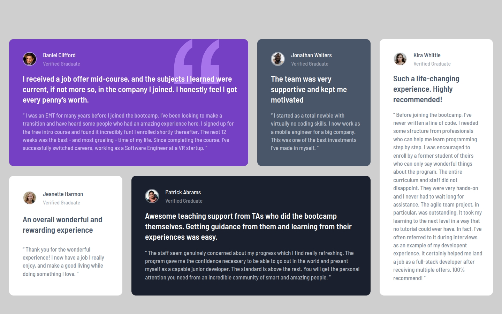

# Frontend Mentor - Testimonials Gris Section

## Table of contents

- [Overview](#overview)
  - [Screenshot](#screenshot)
  - [Links](#links)
- [My process](#my-process)
  - [Built with](#built-with)
  - [What I learned](#what-i-learned)
  - [Continued development](#continued-development)
- [Author](#author)

## Overview

### Screenshot

### Links

- Solution URL: [code](https://github.com/anderjackie/testimonials-grid-section)
- Live Site URL: [live site](https://htmlpreview.github.io/?https://github.com/anderjackie/testimonials-grid-section/blob/main/index.html)

## My process

### Built with

- Semantic HTML5 markup
- CSS custom properties
- CSS Grid
- Mobile-first workflow

### What I learned

- I improved my ability with the grid and all it's power for positioning.
- The mobile first approah is a life savior.
- I was happy to set and play around with the background-image property.

### Continued development

- Try to find a good balnce to when to use grids and when to use flex.

## Author

- Website - [mysmallcornerofinternet](http://mysmallcornerofinternet.life/)
- Frontend Mentor - [@anderjackie](https://www.frontendmentor.io/profile/anderjackie)
